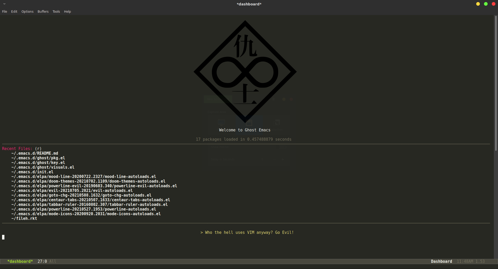
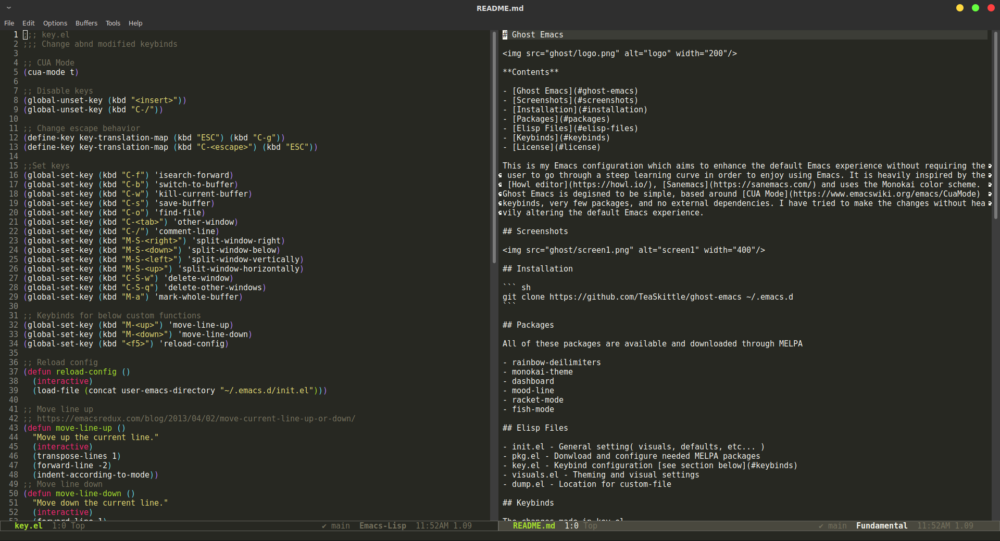

# Ghost Emacs


**Contents**

- [Ghost Emacs](#ghost-emacs)
- [Screenshots](#screenshots)
- [Installation](#installation)
- [Packages](#packages)
- [Elisp Files](#elisp-files)
- [Keybinds](#keybinds)
- [License](#license)

This is my Emacs configuration which aims to enhance the default Emacs experience without requiring the user to go through a steep learning curve in order to enjoy using Emacs. It is inspired by [Howl](https://howl.io/), [Textadept](https://orbitalquark.github.io/textadept/), and [Sanemacs](https://sanemacs.com/). Ghost Emacs is degisned to be simple, based around [CUA Mode](https://www.emacswiki.org/emacs/CuaMode) keybinds, very few packages, and no external dependencies. I have tried to make the changes without heavily altering the default Emacs experience.

## Screenshots




## Installation

``` sh
git clone https://github.com/TeaSkittle/ghost-emacs ~/.emacs.d
```

## Packages

All of these packages are available and downloaded through MELPA

- rainbow-deilimiters
- monokai-theme
- dashboard
- mood-line
- racket-mode
- fish-mode
- markdown-mode
- buffer-move

## Elisp Files

- init.el - General setting( visuals, defaults, etc... )
- pkg.el - Download and configure needed MELPA packages
- key.el - Keybind configuration [see section below](#keybinds)
- visuals.el - Theming and visual settings
- dump.el - Location for custom-file

## Keybinds

List of custom keybinds found in key.el

| Keybinding        | elisp command               |  
|-------------------|-----------------------------|
| `C-f`             | isearch-forward             |  
| `C-b`             | switch-to-buffer            |  
| `C-w`             | kill-current-buffer         |  
| `C-s`             | save-buffer                 |  
| `C-o`             | find-file                   | 
| `C-<tab>`         | other-window                |
| `C-/`             | comment-line                |
| `M-a`             | mark-whole-buffer           |
| `M-<up>`          | move-line-up                |
| `M-<down>`        | move-line-down              |
| `C-S-<up>`        | buf-move-up                 |
| `C-S-<down>`      | buf-move-down               |
| `C-S-<left>`      | buf-move-left               |
| `C-S-<right>`     | buf-move-right              |

## License
[GPLv3](https://choosealicense.com/licenses/gpl-3.0/)
